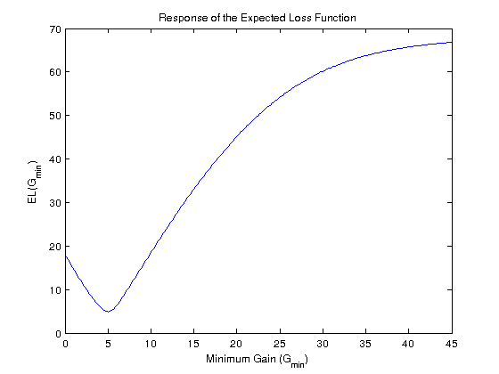
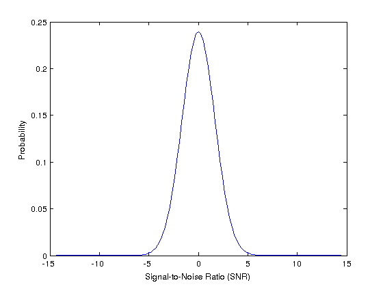
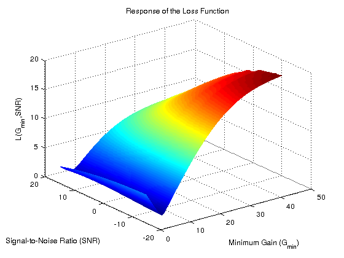

!SLIDE bullets incremental algorithm-performance

# The Problem
* 

* 

* 

* Evaluation of \\(L\\) is expensive

* Evaluation of \\(\text{EL}\\) is _really_ expensive

* _Find the minimum of \\(\text{EL}\\) in as few evaluations of \\(L\\) as possible_

.notes Exhaustive calculation of surface L is not feasible. Evaluation of L is expensive, since we need the final state \(S_{T}\). Gaussian probability distribution fits interesting input SNRs for a given SNR loss. The minimum shown in EL plot is the one we want to find. Large number of x required to accurately model the world.
