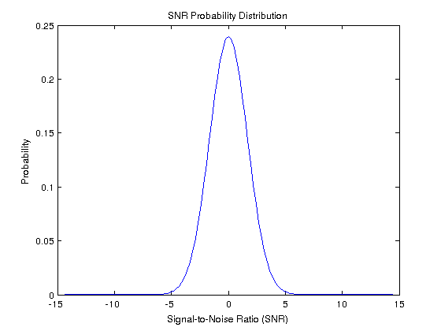

!SLIDE bullets incremental algorithm-performance

# Optimization Problem

\\(\text{EL}(\theta) = \sum\_{k=1}^{K} p(x\_k) L(y\_{k},r\_{k})\\)

* 

* 

* 

* Evaluating \\(L\\) is expensive

* Evaluating \\(\text{EL}\\) is \\(K\\) times as expensive

* _Find an optimization algorithm that solves the optimization problem in as few evaluations of \\(L\\) as possible_
