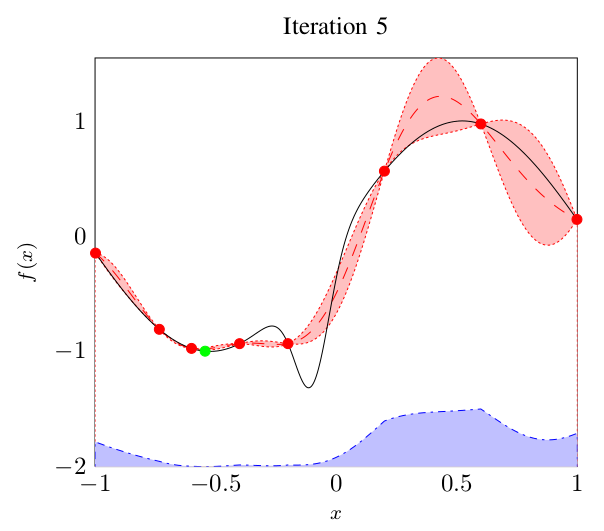
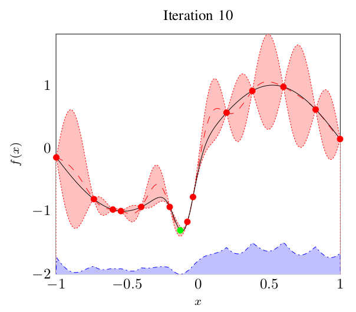
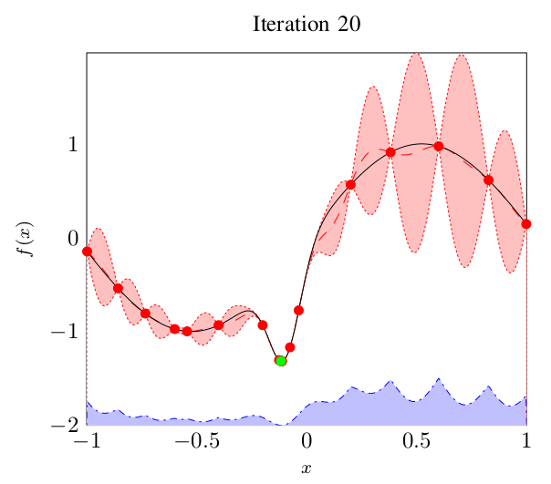

!SLIDE rego-demonstration bullets incremental

# Bayesian Optimization

* Quantify uncertainty using probability distributions

* Optimal experimental design

* _Example minimization problem_

* 
* 
* 
* 
* 
* 
* 
* 
