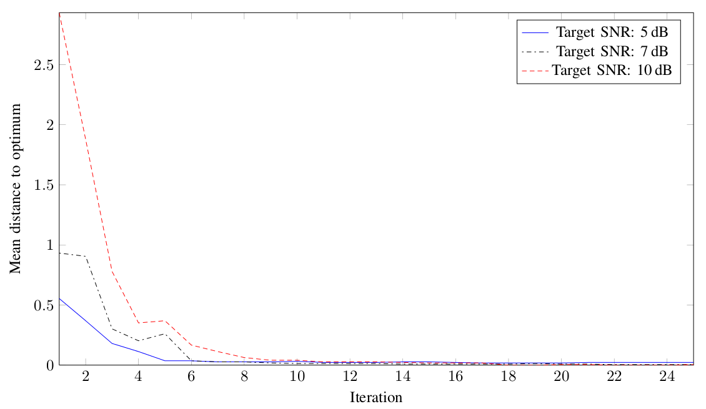

!SLIDE gaussian-process-based-results bullets incremental

# Convergence Behavior

* 

* 30 Evaluations of \\(L\\)

.notes Same experiment as before, but repeated 10 times for each experiment. Uses 10 evaluations of L to create initial model. Non-monotonicity is caused by adjusting the model to the observations (temporary overfit).
